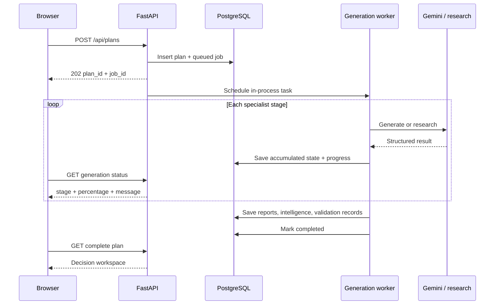
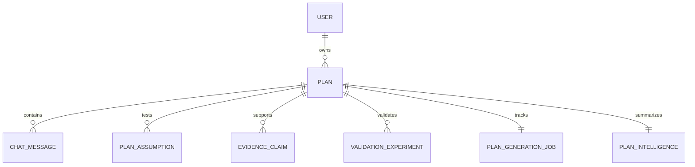

# Architecture

## Product boundary

Prooflane is a three-service application:

1. Next.js renders authentication, the dashboard, the generation timeline, and
   the venture workspace.
2. FastAPI exposes the authenticated API and executes the decision workflow.
3. PostgreSQL stores users, plans, structured validation data, intelligence, chat,
   and durable generation state.

Gemini and web search are external dependencies. PDF, PowerPoint, and Excel files
are generated inside the backend and streamed directly to the caller.

## Request and generation flow

The API request is deliberately decoupled from model latency. Each completed
stage is serialized into `PlanGenerationJob.state_json`; failed or cancelled work
can resume from that accumulated state. Startup recovery reschedules incomplete
jobs after a process restart.

## Agent graph

The supervisor always follows a deterministic order:

| Stage | Responsibility | Output |
|---|---|---|
| Market | Live research and market synthesis | Cited market report and source packet |
| Identity | Distinct venture name, category, thesis | Structured identity |
| Strategy | Value proposition, canvas, GTM, moat | Business model report |
| Capabilities | Product capability map | Structured feature claims |
| Finance | Revenue, costs, unit economics, funding | Narrative plus structured metrics |
| Finance check | Reproducible arithmetic audit | Consistency issues |
| Risk | Downside, SWOT, compliance, mitigation | Risk report |
| Growth | Phased execution and milestones | Growth strategy |
| Validation | Score, flags, experiments, next moves | Validation report and raw score |
| Audit | Cross-section contradiction review | Structured contradiction issues |
| Compiler | Consolidates all specialist work | Full business plan |

Most creative assessments are model-generated. Financial consistency and
evidence-score adjustment are deterministic so their output can be reproduced.

## Data model

- `Plan` stores the six narrative reports, compiled plan, raw score, and status.
- `PlanIntelligence` stores structured finance, contradictions, consistency
  problems, evidence-adjusted score, venture identity, and capability claims.
- `PlanAssumption`, `EvidenceClaim`, and `ValidationExperiment` form the editable
  validation workspace.
- Cascade deletion keeps plan-owned records from becoming orphaned.

## Frontend composition

`frontend/app/page.tsx` handles authentication and creation. The dashboard lists
saved plans. The main page renders a tabbed decision workspace:

- Overview: thesis, score, risk, and venture map.
- Validate: assumptions, source reviews, and experiments.
- Decision: score anatomy, flags, and validation priorities.
- Risks: exposure map, detailed mitigations, and SWOT.
- Full plan, Market, Business model, Financials: specialist outputs and visuals.
- AI mentor: plan-grounded follow-up conversation.

`PlanVisuals.tsx` turns structured or extracted data into decision charts.
`FormattedContent.tsx` renders model Markdown safely as application content.
`ValidationWorkspace.tsx` owns validation CRUD and research refresh.

## Export architecture

- ReportLab constructs a paginated PDF with headings, cards, tables, and charts.
- python-pptx builds a concise 12-slide investor deck from plan sections and
  structured intelligence.
- OpenPyXL builds a multi-sheet workbook for key metrics, allocations,
  assumptions, projections, and narrative context.

Export endpoints enforce plan ownership. The PowerPoint endpoint also requires a
complete compiled plan.

## Scaling boundary

The current design is strong for a single FastAPI replica and a portfolio/demo
deployment. For multi-instance production:

1. Replace `asyncio` background tasks with a queue and dedicated workers.
2. Store checkpoints in explicit JSON/JSONB rather than serialized text.
3. Introduce schema migrations.
4. Add distributed rate limits and job idempotency.
5. Put generated artifacts in object storage if they must be retained.
